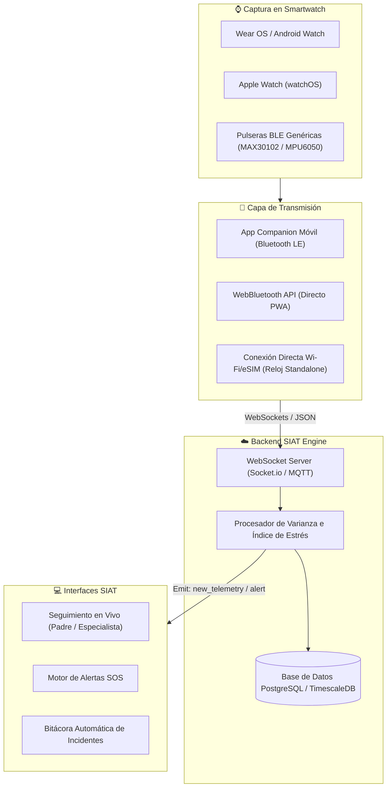

# ⌚ Arquitectura de Telemetría SIAT: Integración Multi-Smartwatch

El subsistema de telemetría es el núcleo vital de **SIAT** (Sistema Integrado de Acompañamiento Terapéutico). Su propósito es capturar en tiempo real la frecuencia cardíaca ($BPM$) y el movimiento ($Acc_x, Acc_y, Acc_z$) desde relojes inteligentes (smartwatches), procesar los datos para detectar estados de alteración o sobrecarga sensorial en niños con TEA y alertar instantáneamente a sus representantes y especialistas.

---

## 🏗️ 1. Diagrama General de la Arquitectura



---

## 📱 2. Capas del Sistema de Telemetría

### Capa 1: Captura Bio-Métrica en el Reloj
Los parámetros universales medidos por cualquier Smartwatch o pulsera inteligente son:
1. **Frecuencia Cardíaca ($BPM$):** Sensor Fotopletismográfico (PPG).
2. **Movimiento Triaxial ($G$-Force):** Acelerómetro / Giroscopio ($Acc_X, Acc_Y, Acc_Z$).
   $$\text{Aceleración Total } (Mov) = \sqrt{Acc_x^2 + Acc_y^2 + Acc_z^2}$$

### Capa 2: Estrategia de Conectividad Multi-Dispositivo
Para garantizar que **cualquier reloj** pueda conectarse a SIAT, se proponen 3 vías según la tecnología del usuario:

| Vía de Conexión | Dispositivos Compatibles | Ventajas | Implementación |
| :--- | :--- | :--- | :--- |
| **A. Companion App Móvil (Recomendado)** | Samsung Galaxy Watch, WearOS, Apple Watch | Funciona sin internet directo en el reloj, buffer offline en el teléfono. | App ligera en Flutter / React Native que actúa como puente Bluetooth. |
| **B. WebBluetooth API (PWA)** | Pulseras y relojes con perfil BLE estándar (Heart Rate Profile / GATT Service) | Sin instalar apps adicionales. Conecta el reloj directo al navegador PWA. | Estándar `navigator.bluetooth` integrado en el Frontend SIAT. |
| **C. App Wear OS / watchOS Standalone** | Relojes con Wi-Fi o eSIM | Independencia total del teléfono inteligente. | App nativa reducida en Kotlin (Wear OS) o Swift (watchOS). |

---

## ⚡ 3. Algoritmo de Detección de Alteración y Sobrecarga Sensorial

El backend de SIAT recibe el paquete de datos cada **2 a 5 segundos** con la siguiente estructura JSON:

```json
{
  "nin_codi": "N001",
  "device_id": "SW-GALAXY-8812",
  "timestamp": 1788904500000,
  "bpm": 118,
  "acc_x": 1.4,
  "acc_y": 2.1,
  "acc_z": 0.8,
  "battery": 88
}
```

### Cálculo del Índice de Estrés ($0 - 100$)
El procesador calcula el nivel de agitación acumulando una media móvil ponderada:
1. **Factor Frecuencia Cardíaca ($F_{BPM}$):** Desviación respecto al ritmo basal en reposo del niño.
2. **Factor Movimiento ($F_{MOV}$):** Magnitud de aceleración brusca continuada.

$$\text{Índice de Estrés} = \alpha \cdot \left(\frac{BPM - BPM_{\text{basal}}}{BPM_{\text{máx}} - BPM_{\text{basal}}}\right) \cdot 100 + \beta \cdot \left(\frac{Mov}{Mov_{\text{máx}}}\right) \cdot 100$$

### Clasificación de Estados:
* **0% – 50% (Calma / Estable):** Indicador Verde en UI.
* **51% – 75% (Inquietud / Alerta):** Indicador Amarillo. Notificación silenciosa en app.
* **76% – 100% (Sobrecarga Sensorial / Crisis):** Indicador Rojo. Disparo automático de **Alerta SOS**, activación de protocolo de respiración y registro en Bitácora.

---

## 🛠️ 4. Hoja de Ruta para Ponerlo a Funcionar (Paso a Paso)

### Fase 1: Simulación de Telemetría Real (Completada en SIAT Frontend)
* `useTelemetry.js` integrado en SIAT escuchando canal WebSocket `new_telemetry`.
* Modo de simulación de crisis para pruebas de interfaz y diseño.

### Fase 2: Módulo WebBluetooth API en Frontend (Pruebas Directas)
* Implementar servicio GATT en el frontend SIAT para conectar con cualquier pulsera o smartwatch que transmita servicio `heart_rate` ($0x180D$) directamente desde el navegador.

### Fase 3: App Companion Puente BLE $\rightarrow$ WebSocket
* Crear una pequeña app acompañante (o plugin PWA) que lea los sensores del reloj vía Bluetooth LE y transmita los paquetes JSON mediante `socket.io-client` al servidor SIAT backend (`backend-siat.onrender.com`).

### Fase 4: Registro y Asociación de Dispositivos por Paciente
* Módulo en SIAT para vincular la MAC / ID del reloj con el expediente del niño (`nin_codi`).

---

> [!TIP]
> **Recomendación para la primera prueba física:** Probar primero mediante **WebBluetooth API** en la PWA de SIAT o mediante la **App Companion Móvil**, ya que permite usar cualquier reloj comercial con Bluetooth activo (Galaxy Watch, Huawei GT, Xiaomi Smart Band, Apple Watch) sin necesidad de aprobar aplicaciones en las tiendas de Apple o Google Play Store.
